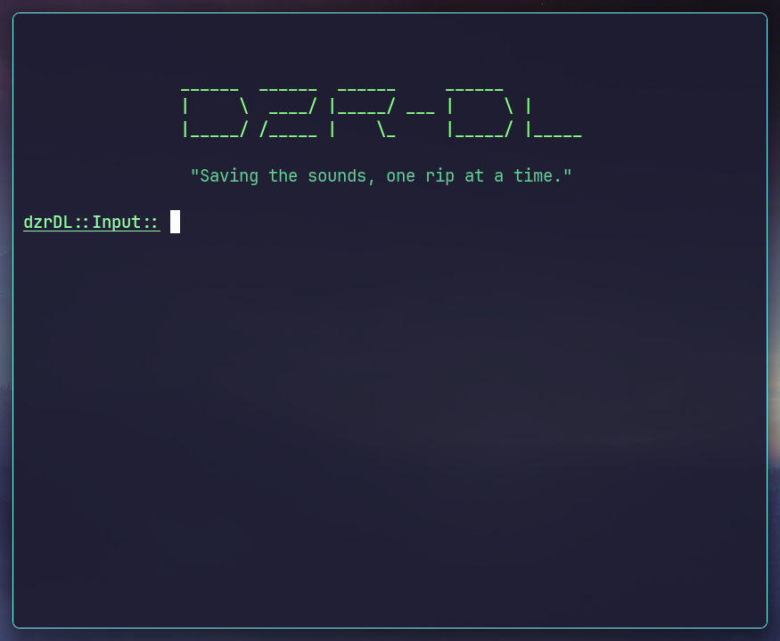

# dzr

This is my program which wraps around Deemix to download songs from Deezer.

> [!IMPORTANT]
> It is the responsibility of the user to ensure that the software is suitable for their purposes. The user assumes all responsibility for any risks associated with the use, or operation of the software. By using this software, the user agrees to hold Taran Nagra harmless from any liability or damage resulting from its use.

## ⬇️ Requirements

You will need Python. I use `3.12.0`, you'll need one that is latest for sure though.

I recommend you to use a virtual environment for this, I use [uv](https://github.com/astral-sh/uv) which is insanely quick!

```bash
uv venv
# activate it
uv pip install -r requirements.txt
```

## 🏃‍♂️ Running

Running is as simple as:

```bash
python main.py
```

## Usage

When loaded, you *should* see the following screen:



& in the input, type in `help` to get a list of available commands!

# ⭐ Ending notes

If you have found this tool to be useful, please consider starring it :D